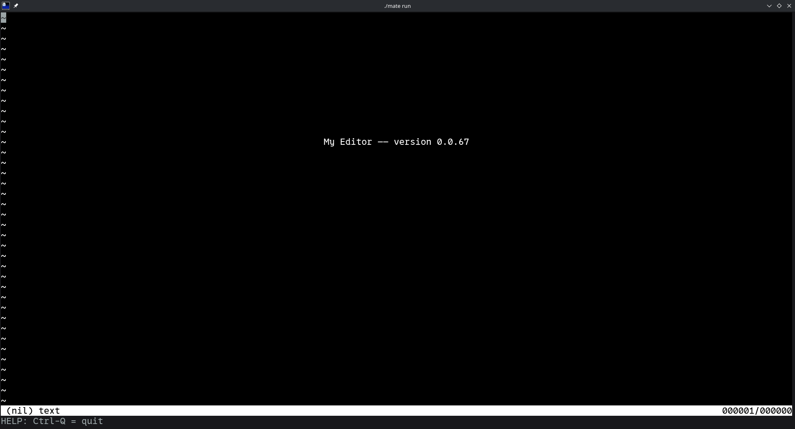

#+title: My Editor

There is nothing special will be in this editor. as I just wanna learn how text editor works.

I'm following [[https://viewsourcecode.org/snaptoken/kilo/][this booklet]] as a guide to this topis. I leaned a lot about how terminal treats escape codes and such. I also learned that the terminal automatically treats =\n= as =\r\n= :O. I really recomend it to anyone interested not only in text editors! however. I'm gonna be using [[https://en.wikipedia.org/wiki/Ncurses][ncurses]] for convieniece.

You might notice that the code in this repo is kinda different from what is in the booklet. Its just because I just code in my own style. also just mixing up =int= and =size_t= for no reason. I'm aware that its not a good thing but I'm too lazy to fix it :P

* Screen Shots
** First Screen Shot (6/7/26)

* Building 
This project use [[https://github.com/TomasBorquez/mate.h][mate.h]]. so building is extremely simple.
#+begin_src bash
cc mate.c -o mate
./mate
#+end_src
after that you can find a =my-editor= executable in =build=

* Contributing
As I'm just writing this to learn how editors works. I'm not gonna accept any pull requests. However, I'm open to critisizms so feel free to open an issue!
